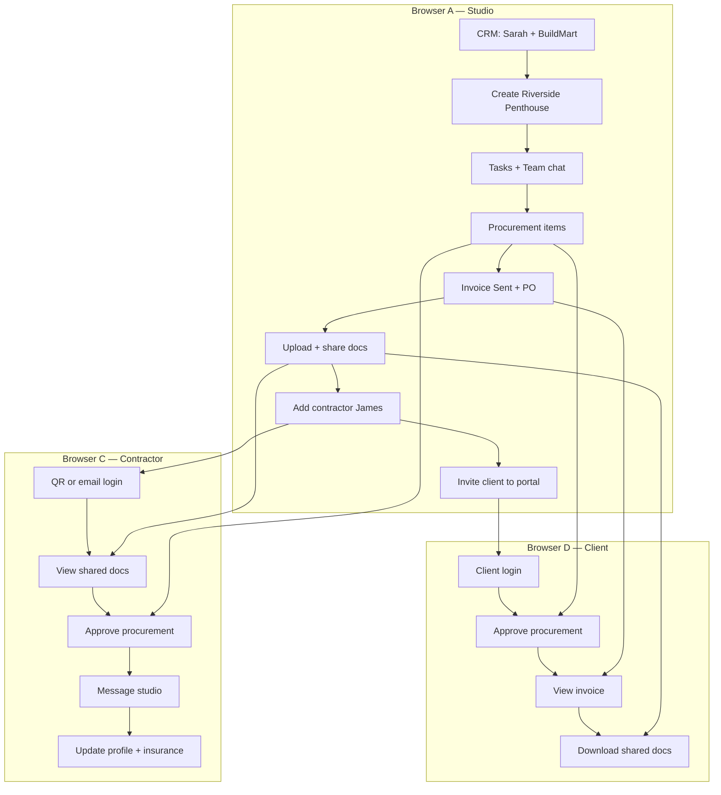

# Focuspilot — End-to-End Testing Guide (4 Apps + API)

Complete manual QA guide for testing **Studio**, **Client Portal**, **Contractor Portal**, and **Supplier Portal** from setup through cross-app verification.

| App | Directory | Dev URL | Port |
|-----|-----------|---------|------|
| **Studio** (main) | `client/` | http://localhost:3000 | 3000 |
| **Client portal** | `client_portal/` | http://localhost:3001 | 3001 |
| **Contractor portal** | `contractors_portal/` | http://localhost:3002 | 3002 |
| **Supplier portal** | `suppliers_portal/` | http://localhost:3003 | 3003 |
| **API** (Django) | `server/` | http://localhost:8000 | 8000 |
| **Marketing** (optional smoke) | `landing/` | http://localhost:3005 | 3005 |

**Related docs:** [test.md](../test.md) (full studio module matrix) · [oneProjectfullworkflow.md](../oneProjectfullworkflow.md) (45-min smoke) · [CONTRACTOR-PORTAL-TESTING-GUIDE.md](../CONTRACTOR-PORTAL-TESTING-GUIDE.md) (share docs + insurance deep dive) · [testing.md](../testing.md) (Gmail Inbox + Notion)

---

## Table of contents

1. [Environment setup](#1-environment-setup)
2. [Master mock data](#2-master-mock-data)
3. [Browser layout (recommended)](#3-browser-layout-recommended)
4. [Studio app — full feature test paths](#4-studio-app--full-feature-test-paths)
5. [Contractor portal — full feature test paths](#5-contractor-portal--full-feature-test-paths)
6. [Client portal — full feature test paths](#6-client-portal--full-feature-test-paths)
7. [Supplier portal — full feature test paths](#7-supplier-portal--full-feature-test-paths)
8. [Cross-app E2E scenarios](#8-cross-app-e2e-scenarios)
9. [API verification checklist](#9-api-verification-checklist)
10. [Role & permission matrix](#10-role--permission-matrix)
11. [Known gaps & skip list](#11-known-gaps--skip-list)
12. [Pass / fail criteria](#12-pass--fail-criteria)

---

## 1. Environment setup

### 1.1 Start all services (5 terminals)

```powershell
# Terminal 1 — API
cd server
.\.venv\Scripts\Activate.ps1
python manage.py migrate
python manage.py runserver

# Terminal 2 — Studio
cd client
pnpm dev

# Terminal 3 — Client portal
cd client_portal
pnpm dev

# Terminal 4 — Contractor portal
cd contractors_portal
pnpm dev

# Terminal 5 — Supplier portal (optional — procurement/supplier E2E)
cd suppliers_portal
pnpm dev
```

### 1.2 Environment variables

Copy `server/.env.example` → `server/.env`. Minimum for portal E2E:

```env
SECRET_KEY=dev-secret-key
DEBUG=True
FRONTEND_URL=http://localhost:3000
CLIENT_PORTAL_URL=http://localhost:3001
CONTRACTOR_PORTAL_URL=http://localhost:3002
SUPPLIER_PORTAL_URL=http://localhost:3003
CORS_ALLOWED_ORIGINS=http://localhost:3000,http://localhost:3001,http://localhost:3002,http://localhost:3003
RESEND_API_KEY=re_xxx          # Required for contractor + client invite emails + proposal/invoice send
OPENAI_API_KEY=sk-xxx          # Required for AI note-taker, proposals AI, daily brief (or use mock — see below)
```

Each frontend app (`client/`, `client_portal/`, `contractors_portal/`, `suppliers_portal/`):

```env
NEXT_PUBLIC_API_URL=http://localhost:8000
```

Studio-only optional mock (skips live OpenAI on some AI UI):

```env
# client/.env.local
NEXT_PUBLIC_AI_USE_MOCK=true
```

Integrations (test when configured):

| Integration | Env vars | Studio path / test |
|-------------|----------|-------------------|
| Gmail + Calendar | `GMAIL_CLIENT_ID`, `GMAIL_CLIENT_SECRET` | `/settings/studio/integrations` → `/ai/inbox` |
| Xero | `XERO_CLIENT_ID`, `XERO_CLIENT_SECRET` | Integrations → push invoice from `/finance/invoices/{id}` |
| QuickBooks | `QUICKBOOKS_CLIENT_ID`, `QUICKBOOKS_CLIENT_SECRET` | `/settings/studio/integrations` |
| Notion | `NOTION_CLIENT_ID`, `NOTION_CLIENT_SECRET` | Integrations → map DB → sync tasks |
| Stripe billing (SaaS) | `STRIPE_SECRET_KEY`, price IDs | `/settings/studio/billing` |
| Stripe Connect (client pay) | `STRIPE_*` + Connect onboarding | `/settings/studio/finance` → client portal **Pay now** |
| Zapier / Public API | API key from settings | `/settings/studio/api` → `GET /integrations/v1/projects/` |
| OpenAI | `OPENAI_API_KEY` | `/ai/note-taker`, `/crm/proposals/new`, `/ai/daily-brief` |
| Vexa (live Meet) | `VEXA_API_KEY`, `VEXA_API_BASE`, `VEXA_WEBHOOK_SECRET` | `/ai/note-taker` → join bot; webhook `POST /meetings/vexa/webhook/` |
| Meshy (3D design) | `MESHY_API_KEY` | `/design` → generate 3D |
| AWS S3 | AWS creds in server env | Project docs upload |
| Chrome clipper | Extension + studio login | `POST /clipper/extract_product_details/` |

### 1.3 Create test accounts (once)

Register via http://localhost:3000/register or use these if already seeded:

| Role | Email | Password | Used in |
|------|-------|----------|---------|
| Studio Admin | `admin.test@focuspilot.dev` | `TestPass1!` | Browser A — full access |
| Studio Manager | `manager.test@focuspilot.dev` | `TestPass1!` | Browser B — collaboration |
| Studio Member | `member.test@focuspilot.dev` | `TestPass1!` | Permission tests |

Portal users are **created from Studio** during project setup (see §2 and §8).

---

## 2. Master mock data

Use these values **everywhere** so CRM → Project → Finance → Portals stay linked.

### 2.1 Studio

| Entity | Value |
|--------|-------|
| Studio name | `Focus Test Studio` |
| Default currency | `GBP` |
| Timezone | `Europe/London` |

### 2.2 CRM contacts

**Client (project owner + client portal user)**

| Field | Value |
|-------|-------|
| Type | Client |
| Name | `Sarah` / Surname `Mitchell` |
| Company | `Mitchell Home Ltd` |
| Email | `sarah.mitchell@mitchellhome.co.uk` |
| Phone | `+44 20 7946 0123` |
| Address | `42 Belgravia Lane`, London `SW1A 1AA`, UK |

**Supplier (procurement + PO)**

| Field | Value |
|-------|-------|
| Type | Supplier |
| Company | `BuildMart Supplies Ltd` |
| Email | `orders@buildmart.co.uk` |
| Phone | `+44 20 7946 0999` |

**Lead (CRM pipeline — optional)**

| Field | Value |
|-------|-------|
| Name | `Tom` / `Hartley` |
| Company | `Hartley Developments` |
| Email | `tom.hartley@hartleydev.co.uk` |
| Stage | `Qualified` |
| Value | `95000` GBP |

### 2.3 Hero project — Riverside Penthouse

| Field | Value |
|-------|-------|
| Project name | `Riverside Penthouse` |
| Project code | `RIV-2026` |
| Type | Residential |
| Client | Sarah Mitchell / Mitchell Home Ltd |
| Description | `Full interior design — 3-bed penthouse, Thames view` |
| Start / End | `2026-06-01` → `2026-12-15` |
| Budget | `185000` GBP |
| Payment schedule | Per Phase |
| FF&E % | `15` |
| VAT | `20` |
| Delivery postcode | `SW11 4NJ` |

**Phases**

| # | Phase name | Duration |
|---|------------|----------|
| 1 | `Concept & Mood` | 4 weeks |
| 2 | `Detail Design` | 6 weeks |
| 3 | `Procurement & Install` | 12 weeks |

**Rooms**

| Room name |
|-----------|
| `Master Bedroom` |
| `Living Room` |
| `Kitchen` |

### 2.4 Tasks

| Task title | Phase | Assignee | Due | Priority |
|------------|-------|----------|-----|----------|
| `Prepare mood boards` | Concept & Mood | manager.test@focuspilot.dev | 2026-06-20 | High |
| `Review FF&E selections` | Detail Design | admin.test@focuspilot.dev | Next Friday | Medium |
| `Site measure — kitchen` | Detail Design | member.test@focuspilot.dev | 2026-07-01 | Low |

**Team chat message:** `Kick-off call moved to Tuesday 3pm`

### 2.5 Procurement items

| Room | Item | Supplier | Qty | Unit cost | Status path |
|------|------|----------|-----|-----------|-------------|
| Master Bedroom | `Custom oak wardrobe` | BuildMart Supplies | 1 | `4200` | Ordered → Shipped → Delivered |
| Living Room | `Velvet sectional sofa` | BuildMart Supplies | 1 | `8900` | Pending → Ordered |
| Kitchen | `Quartz worktop` | BuildMart Supplies | 1 | `3200` | Pending |

**Client visibility:** Enable `client_access` on wardrobe + sofa (not worktop initially).

**Contractor share:** Share wardrobe item with James Fletcher (contractor).

### 2.6 Finance documents

| Doc | Key fields |
|-----|------------|
| **Invoice** | Client Sarah · Project Riverside · Line `Concept design fee — Phase 1` · `12500` GBP · Status: Draft → **Sent** |
| **PO** | `PO-RIV-001` · BuildMart · Line `Oak flooring supply` · `6800` GBP |

Invoice must be marked **Sent** (`inv_sent=true`) for client portal visibility.

### 2.7 Documents (studio uploads)

| Item | Path | Share to |
|------|------|----------|
| Folder | `Concept Drawings` | — |
| File | `test-floorplan.pdf` (< 5 MB) inside folder | Contractor + Client |
| File | `mood-board-v1.pdf` | Client only |
| Link | `https://example.com/inspiration` (type LINK) | Client |

### 2.8 Contractor — James Fletcher

| Field | Value |
|-------|-------|
| First / Surname | `James` / `Fletcher` |
| Company | `Fletcher & Sons Builders` |
| Email | `james@fletcherbuilders.co.uk` |
| Phone | `+44 7700 900123` |
| Trade | `Joinery` |
| Access code | Note when created (e.g. `JFLT-01`) |
| Emergency contact | `Jane Fletcher` / `+44 7700 900456` |
| Insurance expiry | `2027-01-01` |
| Insurance doc | Upload any small PDF |

### 2.9 Client portal credentials

Created from Studio → **Project → Settings → Invite Client to Onboard**:

| Field | Value |
|-------|-------|
| Login email | Same as CRM client email OR generated (e.g. `client.user@test.dev`) |
| Password | Set by invite API (often equals email until changed) |
| Portal URL | http://localhost:3001/login |

### 2.10 Library product (optional)

| Field | Value |
|-------|-------|
| Name | `Herringbone oak flooring` |
| SKU | `FLR-OAK-HB-01` |
| Supplier | BuildMart Supplies |
| Unit price | `85` per m² |
| URL | `https://buildmart.example.com/oak-herringbone` |

### 2.11 Proposal (CRM — optional)

| Field | Value |
|-------|-------|
| Title | `Riverside Penthouse — Concept Phase` |
| Client | Sarah Mitchell |
| Scope (paste or AI) | `Full interior design — concept through install` |
| Line item (AI or manual) | `Concept design fee — Phase 1` · qty `1` · rate `45000` |
| Status | Draft → Sent (requires `RESEND_API_KEY`) |

**AI draft test:** On scope step → **Draft with AI** (`POST /crm/proposals/ai-draft/` `draft_type: scope`). On pricing step → **AI Suggest** (`draft_type: pricing`).

### 2.12 AI note-taker — site visit transcript (paste test)

Use on `/ai/note-taker` or project **Latest Notes** tab (link note to Riverside project):

```text
Site walk — Riverside Penthouse, 10 June 2026.
Living room: client wants lighter oak flooring, confirm lead time with BuildMart.
Kitchen: quartz sample approved; measure site visit booked for 15 June.
Action: Sarah to confirm sofa fabric by Friday.
Decision: proceed with Concept & Mood phase sign-off.
Risk: wardrobe lead time 12 weeks — flag in procurement.
```

Expected after **Generate**: summary, decisions, risks, action items. **Approve** → published. **Convert to task** → task on Riverside board.

### 2.13 Time entry

| Field | Value |
|-------|-------|
| Project | Riverside Penthouse |
| Task | Prepare mood boards |
| Hours | `3.5` |
| Notes | `Mood board revisions` |

---

## 3. Browser layout (recommended)

Use **4–5 browser windows or profiles** for parallel cross-app testing:

```
┌─────────────────────────┬─────────────────────────┐
│  A: Studio (Admin)      │  B: Studio (Manager)    │
│  localhost:3000         │  localhost:3000         │
│  CRM, Project, Finance  │  Tasks, Team chat       │
├─────────────────────────┼─────────────────────────┤
│  C: Contractor Portal   │  D: Client Portal       │
│  localhost:3002         │  localhost:3001         │
│  Docs, Proc, Messages   │  Docs, Proc, Finance    │
└─────────────────────────┴─────────────────────────┘
│  E: Supplier Portal (optional) — localhost:3003   │
└───────────────────────────────────────────────────┘
```

---

## 4. Studio app — full feature test paths

Login as **admin.test@focuspilot.dev** unless testing permissions (§10).

### 4.1 Authentication & onboarding

| # | Feature | Path | Steps | Expected |
|---|---------|------|-------|----------|
| 4.1.1 | Register | `/register` | New email `alpha.register@test.dev`, password `TestPass1!` | OTP or redirect to onboarding |
| 4.1.2 | Login | `/login` | admin credentials | Dashboard loads, sidebar visible |
| 4.1.3 | 2FA | `/verify-2fa` | Enable in `/settings/user/security`, logout, login again | TOTP prompt after password |
| 4.1.4 | Password reset | `/reset-password` | Request reset for admin email | New password works |
| 4.1.5 | Google OAuth | `/auth/google/callback` | Sign in with Google (if configured) | Session created |
| 4.1.6 | Onboarding wizard | `/onboarding` | Role → Studio name → Branding → Invite team | Lands on `/home/dashboard` |
| 4.1.7 | Accept team invite | `/accept-invitation?token=` | Open invite link from email | `POST /user/accept-invitation/` 200; user joins studio |
| 4.1.8 | Billing gate | Any protected route | New studio without plan | Subscription gate modal |
| 4.1.9 | Billing success | `/billing/success` | Complete Stripe test checkout | Plan active |

### 4.2 Home & personal workspace

| # | Feature | Path | Mock data / action | Expected |
|---|---------|------|-------------------|----------|
| 4.2.1 | Dashboard | `/home/dashboard` | Toggle My / Studio scope | KPIs, daily brief hero load |
| 4.2.2 | AI Inbox | `/ai/inbox` | Connect Gmail → Sync | Threads categorized (action/procurement/fyi) |
| 4.2.3 | Home Inbox | `/home/inbox` | Same Gmail account | Classic thread list (not AI) |
| 4.2.4 | My Tasks | `/home/tasks` | Drag task across status columns | Kanban updates persist |
| 4.2.5 | Home calendar | `/home/calendar` | View task due dates | Calendar renders |
| 4.2.6 | Time tracking | `/home/time` | Log 3.5h on Riverside (§2.13) | Entry saved, week grid updates |
| 4.2.7 | Top-bar timer | Global | Start timer on active task | Timer runs, stop saves entry |

### 4.3 Calendar (studio-wide)

| # | Feature | Path | Action | Expected |
|---|---------|------|--------|----------|
| 4.3.1 | Studio calendar | `/calendar` | Month/week navigation | Phases, tasks, deliveries shown |
| 4.3.2 | Studio calendar alt | `/calendar/studio` | Add event via dialog | Event appears on calendar |
| 4.3.3 | Project calendar | `/projects/{id}/calendar` | Open from Riverside project | Project-scoped events only |

### 4.4 Projects — core lifecycle

| # | Feature | Path | Mock data | Expected |
|---|---------|------|-----------|----------|
| 4.4.1 | Project list | `/projects` | Filter, search | Riverside card visible |
| 4.4.2 | Create project | `/projects` → New | §2.3 hero project | Card created with budget/phases |
| 4.4.3 | Project overview | `/projects/{id}` | Open Riverside | Health, phases, budget correct |
| 4.4.4 | Tasks | `/projects/{id}/tasks` | §2.4 tasks | Tasks in correct phases |
| 4.4.5 | Task comments | Task modal | Comment + @mention (Browser B) | Sync ~5s, notification fires |
| 4.4.6 | Project plan | `/projects/{id}/plan` | View Gantt/timeline | Phase tasks on timeline |
| 4.4.7 | Team chat | `/projects/{id}/team` | §2.4 chat message | Message sync; presence "Viewing now" |
| 4.4.8 | Project email | `/projects/{id}/messages` | Gmail connected | Threads scoped to project |
| 4.4.9 | Procurement | `/projects/{id}/procurement` | §2.5 items | Room hierarchy, status updates |
| 4.4.10 | Share proc to contractor | Procurement row menu | Select James Fletcher | `POST /contractor_portal/share-procurement/` 200 |
| 4.4.11 | Bulk share procurement | Multi-select rows | Bulk share dialog | `bulk-share-procurements` 200 |
| 4.4.12 | Client proc access | Procurement settings | Enable client visibility per item | Client portal sees subset |
| 4.4.12b | FF&E export | `/projects/{id}/procurement` | **Export FF&E** → CSV or HTML | `GET /projects/export-ffe-schedule/?format=csv` downloads |
| 4.4.13 | Project finance | `/projects/{id}/finance` | View budget vs actual | Totals match invoice/PO |
| 4.4.14 | Project invoices | `/projects/{id}/finance/invoices` | Create/edit invoice | Project-scoped list |
| 4.4.15 | Project POs | `/projects/{id}/finance/purchase-order` | Link PO to project | PO appears in list |
| 4.4.16 | Documents root | `/projects/{id}/docs` | Upload §2.7 files | Folder tree renders |
| 4.4.17 | Document folder | `/projects/{id}/docs/folders/{id}` | Browse nested folder | Upload, version, preview |
| 4.4.18 | Client doc access | Docs → toggle client_access | Enable on floorplan | Client portal sees file |
| 4.4.19 | Bulk share docs (contractor) | Docs multi-select | Share with James | `bulk-share-documents` 200 |
| 4.4.20 | Project AI notes | `/projects/{id}/docs` → **Latest Notes** tab | Paste site visit transcript | AI summary + action items; Approve publishes; Convert → creates task on project |
| 4.4.21 | Contractors tab | `/projects/{id}/contractors` | Add James Fletcher (§2.8) | Card with access code, insurance badge |
| 4.4.22 | Contractor messages | Contractor card → Message | Send studio message | Appears in contractor portal |
| 4.4.23 | Contractor profile drawer | Contractor card → Profile | Edit trade, insurance | PATCH 200, badge updates |
| 4.4.24 | Project settings | `/projects/{id}/settings` | QR code, client invite, rooms | QR renders; credentials generated |

### 4.5 CRM

| # | Feature | Path | Mock data | Expected |
|---|---------|------|-----------|----------|
| 4.5.1 | Contacts list | `/crm/contacts` | Add Sarah + BuildMart (§2.2) | Both contacts saved |
| 4.5.2 | Contact detail | `/crm/contacts/{id}` | Notes, linked projects | Profile editable |
| 4.5.3 | Lead pipeline | `/crm/pipeline` | Add Tom Hartley lead (§2.2) | Kanban card draggable |
| 4.5.4 | Convert lead | Pipeline card menu | Convert to project | New project pre-filled |
| 4.5.5 | Proposals list | `/crm/proposals` | List all proposals | Table loads |
| 4.5.6 | New proposal wizard | `/crm/proposals/new` | Client → Scope → Pricing → Review (§2.11) | Draft saved via `POST /crm/proposals/` |
| 4.5.7 | AI scope draft | Proposal wizard → Scope step | **Draft with AI** or **AI Enhance** | `POST /crm/proposals/ai-draft/` `draft_type: scope` → `scope` populated |
| 4.5.8 | AI pricing draft | Proposal wizard → Pricing step | **AI Suggest** (after scope filled) | `draft_type: pricing` → `line_items[]` with rate/amount |
| 4.5.9 | Send proposal | `/crm/proposals/{id}` or Review step | **Send** | `POST /crm/proposals/{id}/send/` 200; status SNT; email via Resend |

### 4.6 Finance (studio-level)

| # | Feature | Path | Mock data | Expected |
|---|---------|------|-----------|----------|
| 4.6.1 | Finance hub | `/finance` | View summary cards | PO + invoice totals |
| 4.6.2 | Create invoice | `/finance/invoices/new` | §2.6 invoice | Invoice saved |
| 4.6.3 | Edit invoice | `/finance/invoices/{id}` | Status Draft → Sent | Client portal sees it |
| 4.6.4 | Invoice PDF | `/finance/invoices/pdf/{id}` | Open in new tab | Print layout, no app chrome |
| 4.6.5 | Send invoice email | Invoice detail | Send to client | Email dispatched (Resend) |
| 4.6.6 | Payment reminder | `/finance/invoices` | Overdue/sent invoice → **Send reminder** | `POST /finance/invoices/{id}/send-reminder/` 200 |
| 4.6.7 | Stripe Connect | `/settings/studio/finance` or `/finance/stripe-connect` | Onboard studio | Client portal **Pay now** enabled when complete |
| 4.6.8 | Create PO | `/finance/purchase-order` | §2.6 PO | PO saved |
| 4.6.9 | PO from procurement | `/finance/purchase-order/new` | Create from procurement line | `POST /finance/create-po-from-procurement/` |
| 4.6.10 | PO PDF | `/finance/purchase-order/pdf/{id}` | Open PDF route | Layout correct |
| 4.6.11 | Bulk delete | Finance list | Select multiple → delete | Items removed |

### 4.7 Library

| # | Feature | Path | Mock data | Expected |
|---|---------|------|-----------|----------|
| 4.7.1 | Products catalog | `/library/products` | §2.10 product | CRUD works |
| 4.7.2 | Add to procurement | Product row action | Add to Riverside / Living Room | Item appears in project procurement |
| 4.7.3 | Product preview | `/library/products/preview` | Open product | Detail view loads |
| 4.7.4 | Materials | `/library/materials` | Products with material specs | `GET /library/studio-products/?materials_only=1` |
| 4.7.5 | Chrome clipper | Extension popup | Clip product URL from supplier site | `POST /clipper/extract_product_details/` → save to library |

### 4.8 Team

| # | Feature | Path | Action | Expected |
|---|---------|------|--------|----------|
| 4.8.1 | Team workload | `/teams` | View member calendar | All studio members listed |
| 4.8.2 | Invite member | `/teams` or settings | `newmember@test.dev` as Member | Invite email sent |
| 4.8.3 | Pay rate | Member card | Set hourly rate | Rate saved for reports |

### 4.9 Reports

| # | Feature | Path | Verify against |
|---|---------|------|----------------|
| 4.9.1 | Reports hub | `/reports` | 6 category cards |
| 4.9.2 | Overview | `/reports/overview` | Invoice £12500, time 3.5h |
| 4.9.3 | Projects | `/reports/projects` | Expand Riverside → phases |
| 4.9.4 | Team | `/reports/team` | Hours / Utilisation / Timesheet tabs |
| 4.9.5 | Team member | `/reports/team/{id}` | Drill-down to individual |
| 4.9.6 | Finance | `/reports/finance` | Invoice aging, PO spend |
| 4.9.7 | Procurement | `/reports/procurement` | Oak wardrobe status |
| 4.9.8 | Revenue & P&L | `/reports/revenue` | Margin % calculates |
| 4.9.9 | PDF export | Any report page | Export PDF button | File downloads |

### 4.10 Design studio

| # | Feature | Path | Action | Expected |
|---|---------|------|--------|----------|
| 4.10.1 | Design sessions | `/design` | Create 2D session | Chat + image generation |
| 4.10.2 | 3D generation | Design session | Upload image → generate 3D | Meshy status polling, GLB viewer |

### 4.11 AI tools

| # | Feature | Path | Prerequisite | Expected |
|---|---------|------|--------------|----------|
| 4.11.1 | Daily Brief | `/ai/daily-brief` | OpenAI key or mock mode | Brief generates |
| 4.11.2 | Daily Brief test | `/ai/daily-brief/test` | Dev only | Test variant loads |
| 4.11.3 | AI Activity | `/ai/activity` | Prior AI actions | Feed lists events |
| 4.11.4 | Procurement insights | Project procurement page | Stuck quotes exist | AI suggestions panel |
| 4.11.5 | Reports AI chat | Reports page | Reports data loaded | Chat responds via `/reports/chat/` |
| 4.11.6 | AI Note-taker hub | `/ai/note-taker` | `OPENAI_API_KEY` | Sidebar **Note-taker**; create site visit note; review in side panel |
| 4.11.7 | Note-taker site visit E2E | `/ai/note-taker` | Link note to Riverside project | Paste §2.12 transcript → **Generate** → **Approve** → **Convert to task** → task on project board |
| 4.11.8 | Note-taker on project docs | `/projects/{id}/docs` → **Latest Notes** | Same as 4.11.7 | Notes scoped to project; `GET /meetings/meetings/?project_id=` |
| 4.11.9 | Live Google Meet (optional) | `/ai/note-taker` | `VEXA_API_KEY`, valid Meet URL | Create note → **Join bot** → end meeting → **Fetch transcript** (or Vexa webhook) → AI extraction |
| 4.11.10 | Gmail AI polish | `/ai/inbox` | Gmail connected | Compose reply → polish (`POST /gmail/polish-reply/`) |

### 4.12 Settings

| # | Feature | Path | Test action | Expected |
|---|---------|------|-------------|----------|
| 4.12.1 | User profile | `/settings/user/profile` | Update name, avatar | Top bar updates |
| 4.12.2 | Security | `/settings/user/security` | Change password; 2FA setup/disable | TOTP QR works |
| 4.12.3 | Notifications | `/settings/user/notifications` | Toggle prefs | Preferences saved |
| 4.12.4 | Appearance | `/settings/user/appearance` | Dark theme, compact density | Persists after reload |
| 4.12.5 | Time tracking prefs | `/settings/user/time-tracking` | Default rates | Applies to new entries |
| 4.12.6 | Studio general | `/settings/studio/general` | Studio name, currency GBP | Invoice PDFs use settings |
| 4.12.7 | Public profile | `/settings/studio/public-profile` | Publish slug `focus-test-studio` | Live at localhost:3005/studio/... |
| 4.12.8 | Billing | `/settings/studio/billing` | Stripe checkout (test card) | Plan active |
| 4.12.9 | Finance settings | `/settings/studio/finance` | VAT 20%, invoice prefix | New invoices inherit |
| 4.12.10 | Team management | `/settings/studio/team` | Invite, change roles | Members list updates |
| 4.12.11 | Roles matrix | `/settings/studio/roles` | Toggle `finance.view` off for Member | Sidebar hides Finance |
| 4.12.12 | Templates | `/settings/studio/templates` | Create `Residential Standard` template | Pre-fills new project wizard |
| 4.12.13 | Integrations | `/settings/studio/integrations` | Connect Xero, Gmail, Notion | Connected badges |
| 4.12.14 | API & webhooks | `/settings/studio/api` | Create API key, test webhook | See docs/ZAPIER.md |
| 4.12.15 | Branding | `/settings/studio/branding` | Upload logo | Appears on invoices |
| 4.12.16 | Audit logs | `/settings/studio/audit-logs` | Perform admin action first (invite, role change) | `GET /user/studio/audit-logs/` returns live rows (page not in settings sidebar — use direct URL) |

### 4.13 Presentations

| # | Feature | Path | Action | Expected |
|---|---------|------|--------|----------|
| 4.13.1 | Gallery | `/presentations` | Create presentation | Listed in studio gallery |
| 4.13.2 | Editor | `/presentations/{id}` | Add slides, product pins | Saves via `presentations/` API |
| 4.13.3 | Present mode | `/presentations/{id}/present` | Full-screen | No edit chrome |
| 4.13.4 | Public share | `/p/presentations/{token}` | Copy share link (no auth) | `GET /presentations/public/{token}/` |
| 4.13.5 | Project presentations | `/projects/{id}/presentations` | Link to project | Project-scoped list |
| 4.13.6 | Client portal view | Client `:3001/presentations` | Client opens shared deck | Read-only client view |

### 4.14 Help, notifications & UX

| # | Feature | Path | Action | Expected |
|---|---------|------|--------|----------|
| 4.14.1 | Help center | `/help` | Search `invoice` | Results from help articles |
| 4.14.2 | Help article | `/help/projects/create-a-project` | Read + thumbs feedback | Markdown renders |
| 4.14.3 | In-app support chat | Help widget | Ask support question | `POST /help/support/chat/` |
| 4.14.4 | Notifications | `/notifications` | Trigger @mention → open bell | Unread count decreases |
| 4.14.5 | Command palette | Cmd+K | Navigate to Projects | Route changes |
| 4.14.6 | Product tour | First login | Complete tour steps | Tour state saved |
| 4.14.7 | Language switcher | Top bar / settings | Switch en-US ↔ ja-JP | UI translates |
| 4.14.8 | Changelog | `/changelog` | Open entry | `GET /changelog/` loads |

---

## 5. Contractor portal — full feature test paths

**Base URL:** http://localhost:3002

**Prerequisites:** James Fletcher added on Riverside project (Studio §4.4.21); documents and procurement shared (§4.4.10, §4.4.19).

### 5.1 Authentication & session

| # | Feature | Path | Steps | Expected |
|---|---------|------|-------|----------|
| 5.1.1 | Email/password login | `/login` | `james@fletcherbuilders.co.uk` + password from invite | Redirect to `/select-project` or `/dashboard` |
| 5.1.2 | QR + access code | `/project/{accessToken}` | Copy token from Studio → Settings → QR; enter code `JFLT-01` | Dashboard for Riverside |
| 5.1.3 | Invalid access code | `/project/{accessToken}` | Wrong code | Error toast, stay on landing |
| 5.1.4 | Multi-project picker | `/select-project` | Login contractor on 2+ projects | Project cards; pick Riverside |
| 5.1.5 | Auto-select single project | `/login` | Contractor with 1 project only | Skips picker → dashboard |
| 5.1.6 | Protected route guard | `/dashboard` (no session) | Clear localStorage | Redirect to `/login` |
| 5.1.7 | Logout | Sidebar or TopBar menu | Logout | Session cleared → `/login` |
| 5.1.8 | Language switcher | `/login` or landing | Switch en-US ↔ ja-JP | Labels translate |
| 5.1.9 | Project switcher | TopBar / Sidebar | Switch between projects | Context updates without re-login |

### 5.2 Dashboard

| # | Feature | Path | Expected |
|---|---------|------|----------|
| 5.2.1 | Project hero | `/dashboard` | Riverside name, address, banner image |
| 5.2.2 | Project info card | `/dashboard` | Delivery address displayed |
| 5.2.3 | Action items CTA | `/dashboard` | "Requested to view" links to `/procurement` |

### 5.3 Procurement

| # | Feature | Path | Steps | Expected |
|---|---------|------|-------|----------|
| 5.3.1 | List shared items | `/procurement` | — | Only shared items (oak wardrobe) |
| 5.3.2 | Room grouping | `/procurement` | Expand/collapse Master Bedroom | Item count correct |
| 5.3.3 | Search | `/procurement` | Search `oak` | Filters list |
| 5.3.4 | Status filter | `/procurement` | Filter Approved / Pending / Rejected | List updates |
| 5.3.5 | Delivery filter | `/procurement` | Scheduled / Unscheduled | List updates |
| 5.3.6 | Mark viewed | `/procurement` | Open unviewed item | `POST .../mark_viewed/` 200 |
| 5.3.7 | Approve item | `/procurement` | Click Approve | PATCH `client_approval: APR` |
| 5.3.8 | Mark for review | `/procurement` | Click Review | PATCH `client_approval: RVW` |
| 5.3.9 | Reject item | `/procurement` | Click Reject | PATCH `client_approval: REJ`; hidden by default |
| 5.3.10 | Budget overview | Procurement page top | Room budget table | Totals match shared items |
| 5.3.11 | Product link | Item row | Click product name | Opens `product_url` in new tab |
| 5.3.12 | Status sync | After Studio changes status | Refresh procurement | Matches studio (Ordered → Delivered) |

### 5.4 Documents

| # | Feature | Path | Steps | Expected |
|---|---------|------|-------|----------|
| 5.4.1 | Root document list | `/documents` | — | Shared floorplan only (not client-only docs) |
| 5.4.2 | Folder navigation | `/documents/folder/{id}` | Open Concept Drawings | Nested files listed |
| 5.4.3 | Breadcrumb | Folder view | Click parent breadcrumb | Navigates up |
| 5.4.4 | Search | `/documents` | Search `floorplan` | Filters results |
| 5.4.5 | PDF viewer | Click PDF | In-app PDF modal opens |
| 5.4.6 | Image lightbox | Click image file | Zoom / fullscreen works |
| 5.4.7 | Download | File menu → Download | File saves locally |
| 5.4.8 | External link | LINK type doc | Opens new tab |
| 5.4.9 | Mark viewed | Open document | Viewed badge appears |
| 5.4.10 | Unshare (studio) | Studio removes share | Refresh contractor docs | File disappears |

### 5.5 Messages

| # | Feature | Path | Mock data | Expected |
|---|---------|------|-----------|----------|
| 5.5.1 | Message thread | `/messages` | — | Prior studio messages visible |
| 5.5.2 | Send message | `/messages` | `Delivery scheduled Thursday AM` | POST `/messages/` 200 |
| 5.5.3 | Studio reply | Studio contractor dialog | Reply from Browser A | Appears in contractor thread |
| 5.5.4 | Auto-scroll | Send new message | — | Scrolls to latest |

### 5.6 Profile (self-service)

| # | Feature | Path | Mock data | Expected |
|---|---------|------|-----------|----------|
| 5.6.1 | View profile | `/profile` | — | GET `/me/` loads fields |
| 5.6.2 | Edit contact | `/profile` | Update phone | PATCH 200 |
| 5.6.3 | Insurance expiry | `/profile` | `2027-01-01` | Studio card badge turns green |
| 5.6.4 | Upload insurance | `/profile` | Upload PDF | Multipart PATCH succeeds |
| 5.6.5 | Upload trade cert | `/profile` | Upload PDF | Filename shown on reopen |
| 5.6.6 | Emergency contact | `/profile` | Jane Fletcher details | Saved and visible in studio drawer |

### 5.7 Finance

> **Nav note:** `/finance` routes exist but are **not in the contractor sidebar** — test via direct URL or dashboard links.

**Prerequisite:** Studio assigns/sends contractor-related invoices visible to the contractor (linked to Riverside + James Fletcher).

| # | Feature | Path | Steps | Expected |
|---|---------|------|-------|----------|
| 5.7.1 | Invoice list | `/finance` | Open direct URL after studio sends invoice | `GET /contractor_portal/invoices/?project_id=` 200; list renders |
| 5.7.2 | Invoice detail | `/finance/{id}` | Click invoice row | Line items, totals, status badge |
| 5.7.3 | Draft hidden | `/finance` | — | Only sent/paid contractor-visible invoices |
| 5.7.4 | Cross-project isolation | `/finance` | Switch project in picker | Only current project's invoices |
| 5.7.5 | Back navigation | Invoice detail | Back button | Returns to `/finance` |

---

## 6. Client portal — full feature test paths

**Base URL:** http://localhost:3001

**Prerequisites:** Client invited from Studio → Project Settings (§4.4.24); documents shared (§4.4.18); invoice marked Sent (§4.6.3); procurement client_access enabled (§4.4.12).

### 6.1 Authentication & session

| # | Feature | Path | Steps | Expected |
|---|---------|------|-------|----------|
| 6.1.1 | Client login | `/login` | Email + password from invite | Redirect `/dashboard` |
| 6.1.2 | Invalid login | `/login` | Wrong password | Error toast |
| 6.1.3 | Protected guard | `/dashboard` (no session) | Clear localStorage | Redirect `/login` |
| 6.1.4 | Logout desktop | Sidebar user menu | Logout | Session cleared |
| 6.1.5 | Logout mobile | TopBar avatar menu | Logout | Same as desktop |
| 6.1.6 | Language switcher | Any page | en-US ↔ ja-JP | UI translates |
| 6.1.7 | Multi-project picker | Top bar / sidebar `ProjectSwitcher` | Client on 2+ projects | `selectedProjectId` in localStorage; dashboard/proc/finance scope updates |

> **Note:** If login fails with correct password, verify the login form sends the password field (not email twice). Check Network tab for `POST /client_portal/login/`.

### 6.2 Dashboard

| # | Feature | Path | Expected |
|---|---------|------|----------|
| 6.2.1 | Project hero | `/dashboard` | Riverside name, address, banner |
| 6.2.2 | Financial stats | `/dashboard` | Total paid + total due from API |
| 6.2.3 | Action items | `/dashboard` | "Approve Now" links to `/procurement` |
| 6.2.4 | No studio menus | `/dashboard` | No admin sidebar items |

### 6.3 Procurement

| # | Feature | Path | Steps | Expected |
|---|---------|------|-------|----------|
| 6.3.1 | Budget by room | `/procurement` | — | Overview table with room totals |
| 6.3.2 | List items | `/procurement` | — | Wardrobe + sofa (client_access=true) |
| 6.3.3 | Hidden items | `/procurement` | — | Kitchen worktop NOT visible |
| 6.3.4 | Search | `/procurement` | Search `velvet` | Filters to sofa |
| 6.3.5 | Status filter | `/procurement` | Approved / Pending / Rejected | List updates |
| 6.3.6 | Delivery filter | `/procurement` | Scheduled / Unscheduled | List updates |
| 6.3.7 | Approve item | `/procurement` | Approve wardrobe | PATCH `client_approval: APR` |
| 6.3.8 | Mark for review | `/procurement` | Review sofa | PATCH `client_approval: RVW` |
| 6.3.9 | Reject item | `/procurement` | Reject item | Hidden from default view |
| 6.3.10 | Room collapse | `/procurement` | Toggle room section | Chevron works |
| 6.3.11 | Filtered budget | `/procurement` | Apply filters | Overview recalculates |
| 6.3.12 | Studio sync | Studio changes proc status | Client refresh | Status matches |

### 6.4 Finance / Invoices

| # | Feature | Path | Steps | Expected |
|---|---------|------|-------|----------|
| 6.4.1 | Invoice list | `/finance` | — | Sent invoice £12500 visible |
| 6.4.2 | Draft hidden | `/finance` | — | Draft invoices NOT listed |
| 6.4.3 | Search | `/finance` | Search invoice number | Filters list |
| 6.4.4 | Status filter | `/finance` | Sent / Paid / Overdue | List updates |
| 6.4.5 | Invoice detail | `/finance/{id}` | Click invoice number | Line items, totals, status badge |
| 6.4.6 | FF&E row | Invoice detail | — | FF&E line if configured |
| 6.4.7 | Payment footer | Invoice detail | — | Studio payment details shown |
| 6.4.8 | Back navigation | Invoice detail | Back button | Returns to `/finance` |
| 6.4.9 | Stripe Pay now | `/finance/{id}` | Studio Stripe Connect onboarded; invoice Sent/Overdue | **Pay now** → Stripe Checkout → `POST /client_portal/invoices/{id}/pay/` |
| 6.4.10 | Paid status sync | `/finance` | Complete test payment (Stripe test card) | Invoice shows Paid; dashboard paid total updates |
| 6.4.11 | Cross-client isolation | `/finance` | — | No other clients' invoices |

### 6.5 Messages

| # | Feature | Path | Steps | Expected |
|---|---------|------|-------|----------|
| 6.5.1 | Studio messages tab | `/messages` → **Studio** tab | Send message to studio | `GET/POST /client_portal/project-messages/` 200 |
| 6.5.2 | AI support tab | `/messages` → **AI** tab | Ask project question | `POST /client_portal/support/chat/` responds |
| 6.5.3 | Studio reply | Studio project overview messages | Reply from Browser A | Appears in client thread |
| 6.5.4 | Project scoping | Messages | Switch project in picker | Thread scoped to selected project |

### 6.6 Presentations

| # | Feature | Path | Expected |
|---|---------|------|----------|
| 6.6.1 | List | `/presentations` | Shared presentations for project |
| 6.6.2 | View deck | `/presentations/{id}` | Slides render read-only |

### 6.7 Documents

| # | Feature | Path | Steps | Expected |
|---|---------|------|-------|----------|
| 6.7.1 | Root list | `/documents` | — | Floorplan + mood-board (client_access) |
| 6.7.2 | Contractor-only hidden | `/documents` | — | Contractor-shared-only docs NOT visible unless also client_access |
| 6.7.3 | Open folder | `/documents` | Click Concept Drawings | `/documents/folder/{id}` |
| 6.7.4 | Breadcrumb | Folder view | Navigate up | Returns to root |
| 6.7.5 | Search | `/documents` | Search `mood` | Filters results |
| 6.7.6 | PDF preview | Click PDF | Doc viewer modal |
| 6.7.7 | Image gallery | Click image | Lightbox with zoom |
| 6.7.8 | Download | File menu | File saves |
| 6.7.9 | Copy link | LINK doc menu | Clipboard + toast |
| 6.7.10 | Empty state | No shared docs | — | Friendly empty message |

### 6.8 Client portal — skip / not built

| Feature | Status |
|---------|--------|
| In-portal password change | No UI — reset via studio invite flow |
| Outlook Calendar | Marketing only — not in product |

---

## 7. Supplier portal — full feature test paths

**Base URL:** http://localhost:3003

**Prerequisites:** Supplier contact in Studio CRM (`contact_type=SP`, e.g. BuildMart §2.2); supplier registers or receives invite; `STRIPE_*` for payments Connect tests.

### 7.1 Authentication

| # | Feature | Path | Steps | Expected |
|---|---------|------|-------|----------|
| 7.1.1 | Register | `/register` | New supplier account | `POST /supplier_portal/register/` 201 |
| 7.1.2 | Login | `/login` | Supplier credentials | JWT session; redirect `/dashboard` |
| 7.1.3 | Logout | Sidebar | Logout | Session cleared |
| 7.1.4 | Protected guard | `/dashboard` (no session) | Clear storage | Redirect `/login` |

### 7.2 Dashboard & analytics

| # | Feature | Path | Expected |
|---|---------|------|----------|
| 7.2.1 | Dashboard | `/dashboard` | Orders/stats overview from `GET /supplier_portal/dashboard/` |
| 7.2.2 | Analytics | `/analytics` | Performance metrics load |

### 7.3 Catalog & orders

| # | Feature | Path | Steps | Expected |
|---|---------|------|-------|----------|
| 7.3.1 | Products list | `/products` | — | Supplier catalog CRUD |
| 7.3.2 | Add product | `/products/new` | Name, SKU, price, images | `POST /supplier_portal/products/` |
| 7.3.3 | Edit product | `/products/{id}` | Update specs / images | PATCH 200 |
| 7.3.4 | Orders | `/orders` | View order lines from studios | `GET /supplier_portal/orders/` |

### 7.4 Payments (Stripe Connect)

| # | Feature | Path | Steps | Expected |
|---|---------|------|-------|----------|
| 7.4.1 | Connect onboarding | `/payments` | Complete Stripe Connect | `supplier_portal/stripe-connect/*` status active |
| 7.4.2 | Studio catalog browse | Studio `/library` or procurement | Browse supplier catalog | `GET /supplier_portal/catalog/browse/` (studio auth) |
| 7.4.3 | Add to project | Studio procurement | Add supplier product to Riverside | `POST /supplier_portal/catalog/add-to-project/` |

---

## 8. Cross-app E2E scenarios

Run these **in order** to validate the full pipeline across studio + both stakeholder portals (supplier optional).

### Scenario A — Full project lifecycle (~90 min)



| Step | Browser | Action | Path | Pass criteria |
|------|---------|--------|------|---------------|
| 1 | A | Login | `/login` | Dashboard loads |
| 2 | A | Create CRM contacts | `/crm/contacts` | Sarah + BuildMart saved |
| 3 | A | Create project | `/projects` → New | Riverside Penthouse exists |
| 4 | A | Add tasks | `/projects/{id}/tasks` | 3 tasks in phases |
| 5 | B | Team chat | `/projects/{id}/team` | Message syncs ~5s |
| 6 | A | Add procurement | `/projects/{id}/procurement` | 3 items, 3 rooms |
| 7 | A | Enable client access | Procurement row toggles | 2 items client-visible |
| 8 | A | Create invoice | `/finance/invoices/new` | £12500, mark **Sent** |
| 9 | A | Create PO | `/finance/purchase-order` | PO-RIV-001 saved |
| 10 | A | Upload docs | `/projects/{id}/docs` | Folder + 2 PDFs |
| 11 | A | Share doc to client | Docs → client_access | Mood board + floorplan |
| 12 | A | Add contractor | `/projects/{id}/contractors` | James + access code |
| 13 | A | Share doc to contractor | Contractor → Share files | floorplan shared |
| 14 | A | Share procurement | Procurement → share | wardrobe shared |
| 15 | A | Invite client | `/projects/{id}/settings` | Credentials copied / email sent |
| 16 | C | Contractor login | `:3002/project/{token}` + code | Dashboard loads |
| 17 | C | View documents | `/documents` | Floorplan visible |
| 18 | C | Approve procurement | `/procurement` | APR status saved |
| 19 | C | Send message | `/messages` | Studio sees message |
| 20 | C | Update profile | `/profile` | Insurance uploaded |
| 21 | A | Verify contractor | Contractors tab | Insurance badge green |
| 22 | D | Client login | `:3001/login` | Dashboard loads |
| 23 | D | Dashboard stats | `/dashboard` | Paid/due totals correct |
| 24 | D | Approve procurement | `/procurement` | Client approval saved |
| 25 | D | View invoice | `/finance` → detail | £12500 line items |
| 26 | D | Pay invoice (optional) | `/finance/{id}` → **Pay now** | Stripe test payment; status Paid |
| 27 | D | View documents | `/documents` | 2 shared files |
| 28 | D | Send message | `/messages` Studio tab | Studio sees client message |
| 29 | A | AI note-taker | `/ai/note-taker` | Paste §2.12 → Approve → Convert to task |
| 30 | A | CRM AI proposal | `/crm/proposals/new` | AI scope + pricing → Send |
| 31 | C | Contractor invoices | `:3002/finance` | Sent invoice visible (direct URL) |
| 32 | A | Mark invoice Paid (manual) | `/finance/invoices/{id}` | Status PD if not paid via Stripe |
| 33 | D | Refresh finance | `/finance` | Paid total updates |
| 34 | A | Change proc to Delivered | Project procurement | Status updated |
| 35 | C + D | Refresh procurement | Both portals | Status matches studio |

### Scenario B — CRM lead to delivery (~60 min)

| Step | Browser | Action | Expected |
|------|---------|--------|----------|
| 1 | A | Add lead Tom Hartley | `/crm/pipeline` |
| 2 | A | Create proposal with AI | `/crm/proposals/new` — AI scope + pricing (§4.5.7–8) |
| 3 | A | Send proposal | `POST /crm/proposals/{id}/send/` — status Sent |
| 4 | A | Convert lead to project | New project from pipeline |
| 5 | A | Run project setup | Tasks, procurement, finance |
| 6 | A | Invite client + contractor | Portals configured |
| 7 | C + D | Portal smoke | Both log in, see project data |

### Scenario C — Permission isolation (~30 min)

| Step | Browser | Action | Expected |
|------|---------|--------|----------|
| 1 | A | Disable `finance.view` for Member | `/settings/studio/roles` |
| 2 | Member browser | Login as member.test@focuspilot.dev | Finance hidden from sidebar |
| 3 | Member browser | Direct URL `/finance` | PermissionGuard redirect |
| 4 | D | Client portal login | Only Riverside data visible |
| 5 | D | Manually change project_id in API call (devtools) | No other project data returned |

### Scenario D — 45-minute smoke (minimal)

If short on time, run only:

```
Studio:  CRM client → Create project → Task → Procurement → Invoice (Sent) →
         Add contractor → Share doc → Invite client

Contractor:  Login → Documents → Procurement approve → Message

Client:  Login → Messages → Documents → Procurement → Finance invoice (optional Pay)

AI:      Note-taker paste → Approve → Convert to task
```

Exact step IDs: **4.4.2 → 4.4.4 → 4.4.9 → 4.6.3 → 4.4.16 → 4.4.21 → 4.11.7 → 5.1.2 → 5.3.7 → 6.1.1 → 6.5.1 → 6.4.5**

### Scenario E — AI & CRM only (~20 min)

| Step | Browser | Action | Pass |
|------|---------|--------|------|
| 1 | A | Note-taker site visit | §4.11.7 with §2.12 transcript |
| 2 | A | Verify task on board | `/projects/{id}/tasks` shows converted task |
| 3 | A | CRM AI proposal | §4.5.7–9 — scope + pricing AI → send |
| 4 | A | Daily brief | `/ai/daily-brief` generates |
| 5 | A | Audit log entry | `/settings/studio/audit-logs` shows recent actions |

---

## 9. API verification checklist

Open DevTools → Network while running scenarios.

### Studio → Portal onboarding

| Action | Method | Endpoint | Pass |
|--------|--------|----------|------|
| Add contractor | POST | `/contractor_portal/add/` | 200 + `access_code` |
| Generate client login | POST | `/client_portal/generate-client-login/` | 200 |
| Copy client credentials | POST | `/client_portal/copy-client-credentials/` | 200 + login URL |
| Share documents | POST | `/contractor_portal/bulk-share-documents/` | 200, `created` ≥ 1 |
| Share procurement | POST | `/contractor_portal/bulk-share-procurements/` | 200 |
| Remove shared doc | POST | `/contractor_portal/remove-shared-document/` | 200 |

### Contractor portal data

| Action | Method | Endpoint | Pass |
|--------|--------|----------|------|
| QR project info | GET | `/contractor_portal/project/{uuid}/` | 200 + project name |
| Access code auth | POST | `/contractor_portal/project/{uuid}/auth/` | 200 + JWT |
| Dashboard | GET | `/contractor_portal/dashboard/?project_id=&contractor_id=` | 200 |
| Root documents | GET | `/contractor_portal/documents/root_documents/?project_id=&contractor_id=` | Shared files only |
| Mark doc viewed | POST | `/contractor_portal/documents/{id}/mark_viewed/` | 200 |
| Procurement list | GET | `/contractor_portal/procurements/?project_id=&contractor_id=` | Shared items only |
| Approve item | PATCH | `/contractor_portal/procurements/{id}/` | 200 |
| Send message | POST | `/contractor_portal/messages/` | 201 |
| Profile update | PATCH | `/contractor_portal/me/` | 200 (contractor JWT) |

### Client portal data

| Action | Method | Endpoint | Pass |
|--------|--------|----------|------|
| Login | POST | `/client_portal/login/` | 200 + client + projects |
| Dashboard | GET | `/client_portal/dashboard/?project_id=` | 200 |
| Room totals | GET | `/client_portal/room-totals/?project_id=` | 200 |
| Procurements | GET | `/client_portal/procurements/?project_id=` | client_access items only |
| Approve item | PATCH | `/client_portal/procurements/{id}/` | 200 |
| Invoices | GET | `/client_portal/invoices/?project_id=` | inv_sent=true only |
| Pay invoice | POST | `/client_portal/invoices/{id}/pay/` | 200 + Stripe session (Connect required) |
| Project messages | GET/POST | `/client_portal/project-messages/?project_id=` | 200 |
| Support chat | POST | `/client_portal/support/chat/` | 200 AI reply |
| Documents | GET | `/client_portal/documents/root_documents/?project_id=` | client_access only |
| Presentations | GET | `/client_portal/presentations/?project_id=` | 200 |

### CRM / proposals

| Action | Method | Endpoint | Pass |
|--------|--------|----------|------|
| Create proposal | POST | `/crm/proposals/` | 201 |
| AI scope draft | POST | `/crm/proposals/ai-draft/` body `draft_type: scope` | 200 + `scope` |
| AI pricing draft | POST | `/crm/proposals/ai-draft/` body `draft_type: pricing` | 200 + `line_items` |
| Send proposal | POST | `/crm/proposals/{id}/send/` | 200; status SNT |

### Studio finance

| Action | Method | Endpoint | Pass |
|--------|--------|----------|------|
| Send payment reminder | POST | `/finance/invoices/{id}/send-reminder/` | 200 |
| Stripe Connect onboard | POST | `/finance/stripe-connect/onboard/` | 200 |
| FF&E export | GET | `/projects/export-ffe-schedule/?project_id=&format=csv` | 200 file |

### Contractor finance

| Action | Method | Endpoint | Pass |
|--------|--------|----------|------|
| Invoice list | GET | `/contractor_portal/invoices/?project_id=&contractor_id=` | 200 |
| Invoice detail | GET | `/contractor_portal/invoices/{id}/` | 200 |

### Integrations & admin

| Action | Method | Endpoint | Pass |
|--------|--------|----------|------|
| Accept invite | POST | `/user/accept-invitation/` | 200 |
| Audit logs | GET | `/user/studio/audit-logs/` | 200 paginated |
| API key auth | GET | `/integrations/v1/projects/` | 200 with `Authorization: Bearer fp_live_...` |
| Notion sync | POST | `/notion/mapping/sync/` | 200 (if connected) |
| Zapier webhook | POST | Studio-configured webhook URL | 200 on test event |

### Meetings / AI note-taker

| Action | Method | Endpoint | Pass |
|--------|--------|----------|------|
| List notes | GET | `/meetings/meetings/?project_id={id}` | 200, project-scoped |
| Create note | POST | `/meetings/meetings/` | 201 |
| Process pasted text | POST | `/meetings/meetings/{id}/process-text/` | 200, summary + action items |
| Publish | POST | `/meetings/meetings/{id}/publish/` | 200, `note_status=published` |
| Convert action item | POST | `/meetings/meetings/{id}/action-items/{item_id}/convert-to-task/` | 200, task created on project |
| Join bot (optional) | POST | `/meetings/meetings/{id}/join-bot/` | 200 or 502 if Vexa not configured |
| Fetch transcript | POST | `/meetings/meetings/{id}/fetch-transcript/` | 200 after meeting ends |
| Vexa webhook | POST | `/meetings/vexa/webhook/` | 200 with valid `VEXA_WEBHOOK_SECRET` |

### Supplier portal

| Action | Method | Endpoint | Pass |
|--------|--------|----------|------|
| Register | POST | `/supplier_portal/register/` | 201 |
| Login | POST | `/supplier_portal/login/` | 200 + JWT |
| Products | GET/POST | `/supplier_portal/products/` | 200 |
| Orders | GET | `/supplier_portal/orders/` | 200 |
| Stripe Connect | GET | `/supplier_portal/stripe-connect/status/` | 200 |

### Automated backend tests (optional)

```powershell
cd server
.\.venv\Scripts\Activate.ps1
python manage.py test client_portal contractor_portal crm.tests.ProposalAiDraftTest meetings.tests.NoteTakerFlowTests
```

---

## 10. Role & permission matrix

### Studio roles

| Permission | Admin | Manager | Member |
|------------|-------|---------|--------|
| `projects.view/edit` | ✓ / ✓ | ✓ / ✓ | ✓ / limited |
| `finance.view/edit` | ✓ / ✓ | ✓ / ✓ | configurable |
| `clients.view/edit` | ✓ / ✓ | ✓ / ✓ | view only |
| `team.view` | ✓ | ✓ | ✓ |
| `settings.edit` | ✓ | ✗ | ✗ |
| `reports.view` | ✓ | ✓ | ✓ |

Test by toggling matrix at `/settings/studio/roles` and verifying sidebar + direct URL access.

### Portal roles

| Portal | Role | Auth | Scope |
|--------|------|------|-------|
| Client portal | CRM Client (`contact_type=CL`) | Email/password | Selected project via `ProjectSwitcher` (multi-project supported) |
| Contractor portal | CRM Client (`contact_type=CN`) | Email/password OR QR+code | Shared items per project; multi-project picker |
| Supplier portal | Supplier account | Email/password | Own catalog + orders only |

---

## 11. Known gaps & skip list

| Area | Status | E2E action |
|------|--------|------------|
| AI brief → task map | Not built | Skip — homepage marketing only |
| AI procurement (studio panel) | Partial / mock | Use `NEXT_PUBLIC_AI_USE_MOCK=true` or skip |
| Contractor `/finance` in sidebar | UI exists, not in nav | Test via direct URL §5.7 |
| Studio audit logs in sidebar | Page at `/settings/studio/audit-logs` only | Use direct URL §4.12.16 |
| Supplier portal landing page | Product shipped, no marketing page | Test app `:3003` only |
| WebSockets team chat | Polling ~5s | Expect delay in §4.4.5 / §4.4.7 |
| Outlook Calendar | Marketing only | Skip |
| Enterprise SSO | Not built | Skip |
| RFI/PO convert from note-taker | Not built | Only **Convert to task** works §4.11.7 |
| Live Meet without Vexa | Optional | Skip join-bot; use site-visit paste path |
| Free migration tooling | Copy only | Skip import tests |

---

## 12. Pass / fail criteria

### Full E2E PASS requires all:

- [ ] **One linked project** `Riverside Penthouse` with Sarah Mitchell as client
- [ ] **CRM** contacts (client + supplier) exist and link to project
- [ ] **Tasks, procurement, invoice (Sent), PO** created in studio
- [ ] **Documents** uploaded with client_access and contractor share
- [ ] **James Fletcher** on project with working QR/access code login
- [ ] **Contractor portal:** shared PDF visible; procurement approve works; message reaches studio; profile/insurance saves; invoices at `/finance` when assigned
- [ ] **Client invited;** client portal shows dashboard, messages, shared docs, client-visible procurement, sent invoice
- [ ] **Client pay (optional):** Stripe Connect + **Pay now** completes in test mode
- [ ] **AI note-taker:** site-visit paste → approve → convert to task on Riverside
- [ ] **CRM AI proposal:** `ai-draft` scope + pricing → proposal sent
- [ ] **No cross-client data leak** on client portal
- [ ] **Status sync:** studio procurement change reflects in both portals after refresh
- [ ] **Reports/overview** reflects same project time and invoice amounts

### Common FAIL causes

| Symptom | Fix |
|---------|-----|
| No invite email | Set `RESEND_API_KEY` in `server/.env` |
| Contractor sees no docs | Verify `bulk-share-documents` 200; check `contractor_id` |
| Client sees no invoice | Mark invoice **Sent** (`inv_sent=true`) |
| Client sees no procurement | Enable `client_access` on items |
| Wrong portal project | Use client **ProjectSwitcher**; verify `project_id` query on API calls |
| AI proposal 503 | Set `OPENAI_API_KEY` in `server/.env` |
| AI proposal 404 | Restart server after deploy; route is `POST /crm/proposals/ai-draft/` |
| Note-taker empty transcript | Vexa uses `segments[]` — use **Fetch transcript** after meeting ends |
| CORS errors | Add ports 3000–3003 to `CORS_ALLOWED_ORIGINS` |
| Login 401 on portal | Check credentials from copy dialog; verify password field on login form |

---

## Appendix A — Marketing site smoke (optional)

**URL:** http://localhost:3005 (`cd landing && pnpm dev`)

| # | Page | Path | Verify |
|---|------|------|--------|
| A.1 | Homepage | `/` | AI layer cards; note-taker **Available now** badge → `/platform/ai#note-taker` |
| A.2 | Platform AI | `/platform/ai` | Note-taker section + feature cards |
| A.3 | Pricing | `/pricing` | Plans load; CTA to signup |
| A.4 | Compare | `/compare/programa` | Comparison table renders |
| A.5 | Changelog | `/changelog` | v2.7 note-taker entry |
| A.6 | Public studio | `/studio/focus-test-studio` | Loads if public profile published (§4.12.7) |

No API beyond signup redirects — smoke UI/copy only.

---

## Quick reference — URLs

| App | Login | Main areas |
|-----|-------|------------|
| Studio | http://localhost:3000/login | Dashboard `/home/dashboard`, AI `/ai/note-taker`, Projects `/projects`, CRM `/crm/proposals`, Finance `/finance`, Reports `/reports`, Settings `/settings/studio/integrations` |
| Client portal | http://localhost:3001/login | Dashboard `/dashboard`, Messages `/messages`, Procurement `/procurement`, Finance `/finance`, Documents `/documents`, Presentations `/presentations` |
| Contractor portal | http://localhost:3002/login | Dashboard `/dashboard`, Procurement `/procurement`, Documents `/documents`, Messages `/messages`, Profile `/profile`, Finance `/finance` (direct URL) |
| Supplier portal | http://localhost:3003/login | Dashboard `/dashboard`, Products `/products`, Orders `/orders`, Payments `/payments` |
| QR landing | http://localhost:3002/project/{accessToken} | From Studio → Project → Settings → QR code |
| API docs | http://localhost:8000/swagger/ | OpenAPI — all modules |

### Studio sidebar map (QA navigation)

| Sidebar item | Route |
|--------------|-------|
| Home | `/home/dashboard` |
| Inbox (AI) | `/ai/inbox` |
| Note-taker | `/ai/note-taker` |
| My Tasks | `/home/tasks` |
| Calendar | `/calendar` |
| Projects | `/projects` |
| Presentations | `/presentations` |
| CRM | `/crm/pipeline` |
| Finance | `/finance/invoices` |
| Library | `/library/products` |
| Reports | `/reports` |
| Teams | `/teams` |
| Design | `/design` |
| Settings | `/settings/user/profile` |

---

*Last updated: 10 June 2026 · Apps: Studio :3000, Client :3001, Contractor :3002, Supplier :3003, API :8000*
