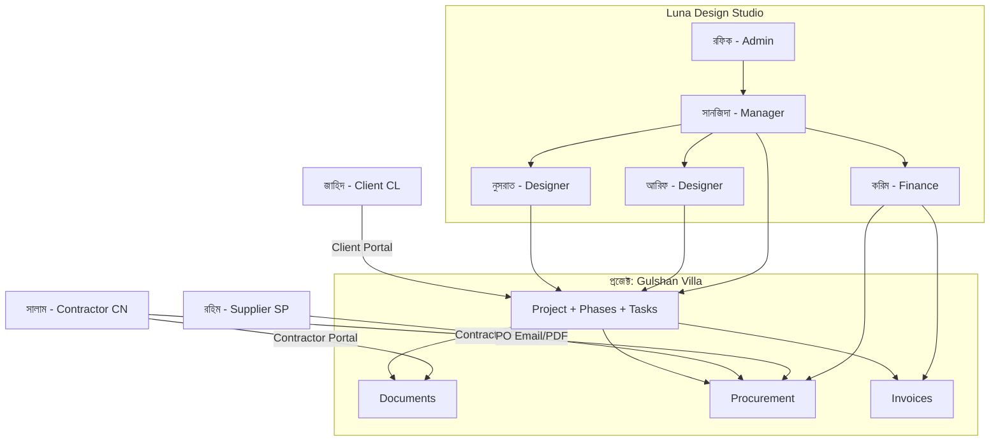

# Focus-Studio (TechStyles) — বাংলায় সম্পূর্ণ শেখার গাইড

> এই ফাইলটি **শুধু শেখার জন্য**। এখানে একটা কাল্পনিক উদাহরণ দিয়ে বোঝানো হয়েছে: কে কে, কী পেশায়, কী সমস্যায় পড়ে, ওয়েবসাইট কীভাবে সাহায্য করে, এবং সবাই একে অপরের সাথে কীভাবে জড়িত।

---

## ১. প্ল্যাটফর্মটা আসলে কী?

**Focus-Studio** (কোডবেসে নাম **TechStyles** বা হেল্প সেন্টারে **Focuspilot**) হলো **আর্কিটেকচার ও ইন্টেরিয়র ডিজাইন স্টুডিও**-র জন্য এক জায়গায়:

- প্রজেক্ট ও টাস্ক
- ক্লায়েন্ট ও ঠিকাদার
- ইনভয়েস ও ক্রয় (Procurement)
- ডকুমেন্ট লাইব্রেরি
- টাইম ট্র্যাকিং ও রিপোর্ট

**মূল ধারণা:** একটা **Studio** (কোম্পানি) → তার ভিতরে **টিম** → বাইরে **Client, Contractor, Supplier** → সবাই এক বা একাধিক **Project**-এর চারপাশে ঘোরে।

---

## ২. আমাদের উদাহরণ — “Luna Design Studio”

ধরুন **Luna Design Studio** ঢাকায় ১২ জনের একটি ইন্টেরিয়র ফার্ম। তারা **Gulshan Villa Interior** নামে একটা প্রজেক্ট নিয়েছে।

| নাম | প্ল্যাটফর্মে কী | বাস্তব জীবনে কী |
|-----|------------------|------------------|
| **রফিক আহমেদ** | Studio Owner / Admin | স্টুডিওর মালিক, সব সিদ্ধান্ত নেন |
| **সানজিদা রহমান** | Manager | প্রজেক্ট ম্যানেজার, টিম ও বাজেট দেখেন |
| **আরিফ হোসেন** | Member (Senior Designer) | সিনিয়র ডিজাইনার, ড্রয়িং ও স্পেস প্ল্যান |
| **নুসরাত জাহান** | Member (Junior Designer) | জুনিয়র, ৩D, ম্যাটেরিয়াল সিলেকশন |
| **করিম উদ্দিন** | Member (Finance) | হিসাব, ইনভয়েস, PO |
| **মো. সালাম** | Contractor (CN) | ইলেকট্রিশিয়ান — সাইটে কাজ |
| **রহিম ট্রেডস** | Supplier (SP) | টাইল ও বাথরুম ফিটিং সাপ্লাই |
| **জাহিদ হাসান** | Client (CL) | ভিলার মালিক, ক্লায়েন্ট |

এই একটা প্রজেক্ট দিয়ে নিচে **পুরো জীবনচক্র** বোঝানো হলো।

---

## ৩. রোলগুলো — কে কে, পেশা কী, ব্যথা কী, সাইট কী দেয়

### ৩.১ স্টুডিওর ভিতরের রোল (লগইন: মেইন অ্যাপ)

এরা `users` টেবিলে **User** — সবাই একই **Studio**-তে যুক্ত।

#### Admin (রফিক — Owner)

| বিষয় | বিস্তার |
|--------|---------|
| **পেশা** | স্টুডিও মালিক / ম্যানেজিং পার্টনার |
| **কী করে** | ব্র্যান্ডিং, বিলিং, টিম ইনভাইট, সব প্রজেক্ট দেখা, ফাইন্যান্স, সেটিংস |
| **ব্যথা (Pain Point)** | “এক্সেল, WhatsApp, ইমেইল — কোথায় কী আছে জানি না”; প্রফিট কম কিনা বুঝতে পারি না |
| **সাইট কী দেয়** | এক ড্যাশবোর্ডে সব প্রজেক্টের স্বাস্থ্য, রিপোর্ট, Xero সিঙ্ক, Roles & Permissions |
| **কার সাথে জড়িত** | সব Manager/Member; Client-কে ইনভয়েস; Contractor-কে ইনভাইট |

**কোডে:** `role = 'admin'` — প্রায় সব permission স্বয়ংক্রিয়ভাবে চালু।

---

#### Manager (সানজিদা)

| বিষয় | বিস্তার |
|--------|---------|
| **পেশা** | প্রজেক্ট ম্যানেজার (PM) |
| **কী করে** | ফেজ তৈরি, টাস্ক অ্যাসাইন, ডেডলাইন, কন্ট্রাক্টর শেয়ার, ক্লায়েন্ট আপডেট |
| **ব্যথা** | “কে কী করছে দেখা যায় না”; সাইটে ঠিকাদার wrong drawing নিয়ে যায় |
| **সাইট কী দেয়** | Project phases & tasks, Procurement শেয়ার, Contractor portal থেকে ডক শেয়ার, টিম workload |
| **কার সাথে জড়িত** | Designers, Client (স্ট্যাটাস), Contractor (ডক/PO), Owner (বাজেট রিপোর্ট) |

**কোডে:** `role = 'manager'` — permission ম্যাট্রিক্সে `projects.edit`, `procurement.edit` ইত্যাদি দেওয়া যায়।

---

#### Member (আরিফ, নুসরাত)

| বিষয় | বিস্তার |
|--------|---------|
| **পেশা** | ডিজাইনার / কোঅর্ডিনেটর |
| **কী করে** | টাস্ক সম্পন্ন, ডক আপলোড, লাইব্রেরি থেকে প্রোডাক্ট, টাইম এন্ট্রি |
| **ব্যথা** | “আমার টাস্ক কোথায়”; পুরনো PDF খুঁজে পাই না |
| **সাইট কী দেয়** | Assigned tasks, Document library, AI Clipper, Time tracker |
| **কার সাথে জড়িত** | PM-এর অ্যাসাইনমেন্ট; কখনও Client-এর ফিডব্যাক (পোর্টালের মাধ্যমে) |

**কোডে:** `role = 'member'` — শুধু যে প্রজেক্টে যোগ, সেখানেই কাজ।

---

#### Finance Member (করিম — Member + Finance permission)

| বিষয় | বিস্তার |
|--------|---------|
| **পেশা** | অ্যাকাউন্ট্যান্ট / অফিস ম্যানেজার |
| **কী করে** | ইনভয়েস, Purchase Order, পেমেন্ট ট্র্যাক, Xero |
| **ব্যথা** | প্রজেক্ট খরচ আলাদা, অফিস খরচ আলাদা — মার্জিন ভুল হয় |
| **সাইট কী দেয়** | Finance মডিউল, Budget vs Actual, Outstanding invoices |
| **কার সাথে জড়িত** | Owner, Client (বিল), Supplier (PO) |

---

### ৩.২ CRM-এর বাইরের যোগাযোগ (Contact Types)

CRM-এ `Client` মডেল — নাম ভুলে যাবেন না: এখানে **সব ধরনের কন্টাক্ট** (ক্লায়েন্টও, ঠিকাদারও)।

| কোড | ধরন | উদাহরণ চরিত্র |
|-----|------|----------------|
| **CL** | Client | জাহিদ হাসান — ভিলার মালিক |
| **CN** | Contractor | মো. সালাম — ইলেকট্রিশিয়ান |
| **SP** | Supplier | রহিম ট্রেডস — টাইল সাপ্লায়ার |

---

#### Client (জাহিদ — CL)

| বিষয় | বিস্তার |
|--------|---------|
| **পেশা** | বাড়ির মালিক / ব্যবসায়ী |
| **কী চায়** | ডিজাইন দেখতে, বিল পরিষ্কার, ডেলিভারি কখন |
| **ব্যথা** | “ফোনে জিজ্ঞেস করি, উত্তর দেরি”; কোন ইনভয়েস পেইড জানি না |
| **সাইট কী দেয়** | **Client Portal** — শুধু তার প্রজেক্ট: ডক, স্ট্যাটাস, ইনভয়েস (যা শেয়ার করা হয়) |
| **কার সাথে জড়িত** | Luna Studio (সানজিদা, করিম); Contractor-কে সরাসরি দেখে না |

**লগইন:** আলাদা Client Portal (`client_portal`) — ইমেইল + পাসওয়ার্ড, `ClientProject` দিয়ে প্রজেক্ট লিংক।

---

#### Contractor (মো. সালাম — CN)

| বিষয় | বিস্তার |
|--------|---------|
| **পেশা** | ইলেকট্রিশিয়ান / সাইট ট্রেডসম্যান |
| **কী করে** | কেবল ও ফিটিং ইনস্টল, সাইটে কাজ |
| **ব্যথা** | পুরনো WhatsApp ড্রয়িং; ইন্স্যুরেন্স চাইলে হারিয়ে যায় |
| **সাইট কী দেয়** | **Contractor Portal** — শেয়ার করা ডক, Procurement, Access code (যেমন `JFLT-01`), মেসেজ |
| **কার সাথে জড়িত** | PM (সানজিদা); Studio; Client-এর সাথে সরাসরি নয় |

**অতিরিক্ত:** `ContractorProfile` — trade, insurance, emergency contact, `access_code`।

---

#### Supplier (রহিম ট্রেডস — SP)

| বিষয় | বিস্তার |
|--------|---------|
| **পেশা** | টাইল / স্যানিটারি সাপ্লায়ার |
| **কী করে** | PO অনুযায়ী মাল ডেলিভারি |
| **ব্যথা** | PO নম্বর মিলে না; ডেলিভারি স্ট্যাটাস ফোনে জানতে হয় |
| **সাইট কী দেয়** | CRM-এ Supplier রেকর্ড, **Purchase Order**, ডেলিভারি ট্র্যাকিং |
| **কার সাথে জড়িত** | Finance (করিম), PM (কি কিনতে হবে) |

---

## ৪. সবাই কীভাবে জড়িত — সম্পর্কের ছক



**সংক্ষেপে:**

- **Studio টিম** = মেইন অ্যাপ (`/home/dashboard`, Projects, Finance…)
- **Client** = আলাদা পোর্টাল, শুধু নিজের প্রজেক্ট
- **Contractor** = আলাদা পোর্টাল, শুধু যে প্রজেক্টে যোগ + যা শেয়ার করা হয়েছে
- **Supplier** = সাধারণত PO পায়; ভবিষ্যতে ট্রেড পোর্টাল URL থাকতে পারে (`trade_login_url`)

---

## ৫. সম্পূর্ণ ওয়ার্কফ্লো — শুধু উদাহরণ (Gulshan Villa)

### ধাপ ০: স্টুডিও সেটআপ (একবার)

1. **রফিক** রেজিস্টার করেন → Onboarding → Studio নাম: **Luna Design Studio**
2. Settings → Studio: লোগো, ঠিকানা, GBP/USD, VAT
3. **Team Invite:** সানজিদা (Manager), আরিফ/নুসরাত (Member), করিম (Member + finance permission)
4. Xero কানেক্ট (ঐচ্ছিক) — ইনভয়েস সিঙ্ক

**ব্যথা সমাধান:** আর আলাদা Google Sheet-এ “কে আমাদের টিমে” নেই।

---

### ধাপ ১: লিড থেকে ক্লায়েন্ট (CRM)

1. **সানজিদা** CRM-এ নতুন কন্টাক্ট: **জাহিদ হাসান**, type = **CL**, status = Negotiation
2. Proposal পাঠানো (ইমেইল/পিডিএফ) — স্ট্যাটাস **Active**
3. **+ New Project:** নাম `Gulshan Villa Interior`, Client = জাহিদ, Budget = ৳৪০ লাখ, Status = **Active**
4. Template থেকে ফেজ: *Concept → Design Development → Procurement → Site*

**ব্যথা সমাধান:** “ক্লায়েন্ট কোন প্রজেক্টে” — এক ক্লিকে CRM ↔ Project লিংক।

---

### ধাপ ২: টিম ও টাস্ক

| ফেজ | টাস্ক | কে |
|------|--------|-----|
| Concept | Mood board | নুসরাত |
| Concept | Client presentation | আরিফ |
| Design Dev | Electrical layout | আরিফ |
| Procurement | Bathroom tile shortlist | নুসরাত |

- **সানজিদা** টাস্ক অ্যাসাইন করেন, ডেডলাইন দেন
- **আরিফ/নুসরাত** সম্পন্ন করলে টিক; **Time tracker**-এ ঘণ্টা লগ

**ব্যথা সমাধান:** “আজ কে কী করবে” — Dashboard + My Tasks।

---

### ধাপ ৩: ক্লায়েন্ট পোর্টাল চালু

1. **সানজিদা** → Invite Client Dialog → জাহিদের ইমেইল
2. সিস্টেম `ClientProject` তৈরি — জাহিদ শুধু **Gulshan Villa** দেখেন
3. জাহিদ লগইন → মুড বোর্ড PDF, প্রগ্রেস %, (ঐচ্ছিক) ইনভয়েস

**জাহিদের অভিজ্ঞতা:**  
> “আগে WhatsApp-এ ২০টা ফাইল — এখন এক লিংক, শুধু আমার বাড়ির প্রজেক্ট।”

**ব্যথা সমাধান:** ২৪/৭ স্বচ্ছতা, কম “কোথায় পৌঁছলাম?” কল।

---

### ধাপ ৪: Procurement ও Supplier

1. **নুসরাত** Library থেকে টাইল সিলেক্ট → প্রজেক্ট Procurement-এ যোগ
2. **করিম** PO তৈরি → Supplier **রহিম ট্রেডস (SP)**
3. স্ট্যাটাস: Ordered → Shipped → Delivered
4. বাজেট: Bathroom room-এ ৳২ লাখ বরাদ্দ — খরচ ৳১.৮ লাখ দেখা যায়

**ব্যথা সমাধান:** “বাজেট শেষ হয়ে গেছে কিনা” — প্রজেক্টে লাইভ।

---

### ধাপ ৫: Contractor যোগ ও সাইট

1. **সানজিদা** → Add Contractor: **মো. সালাম**, Trade = Electrical
2. সিস্টেম `access_code` দেয় (উদাহরণ: `LUNA-07`)
3. `ContractorProject` — Gulshan Villa-তে অ্যাক্সেস
4. Electrical layout PDF **Share to Contractor**
5. Procurement-এর “Cable & conduits” লাইন contractor-কে **শেয়ার**
6. সালাম Contractor Portal খুলে → সর্বশেষ ড্রয়িং ডাউনলোড → সাইটে কাজ

**ব্যথা সমাধান:** ভুল ড্রয়িং কম; ইন্স্যুরেন্স এক্সপায়ারি ট্র্যাক (`insurance_expiry`)।

---

### ধাপ ৬: ফাইন্যান্স ও ক্লায়েন্ট বিল

| ঘটনা | কে | সিস্টেমে কী |
|--------|-----|-------------|
| ডিজাইন ফি ৩০% | করিম | Invoice #INV-001 → জাহিদ |
| মাল কিনেছে স্টুডিও | করিম | PO → রহিম |
| মাইলস্টোন ২ | করিম | Invoice #INV-002 |
| পেমেন্ট | জাহিদ | Paid হিসেবে মার্ক |

- **রফিক** Reports → Project profitability: আয় − খরচ = মার্জিন
- Xero সিঙ্ক হলে অ্যাকাউন্টিং আলাদা টাইপ করতে হয় না

**ব্যথা সমাধান:** “এই প্রজেক্ট লাভে না ক্ষতিতে” — এক রিপোর্ট।

---

### ধাপ ৭: প্রজেক্ট শেষ

1. সব টাস্ক **Done**
2. Status → **Completed**
3. জাহিদ Client Portal-এ ফাইনাল ডক
4. আর্কাইভ — ডেটা থেকে যায়, টিম নতুন প্রজেক্টে যায়

---

## ৬. মডিউল অনুযায়ী — কে কখন কোথায় যায়

| মডিউল | URL ধরন | কে ব্যবহার করে | উদাহরণ কাজ |
|--------|---------|----------------|-------------|
| Dashboard | `/home/dashboard` | সব টিম | আজকের টাস্ক, ব্রিফ |
| Projects | `/projects/...` | Manager, Member | ফেজ, টাস্ক, ডক |
| CRM | Contacts | Manager, Admin | জাহিদ, সালাম, রহিম যোগ |
| Finance | Invoices, PO | Finance, Admin | INV-001, PO টাইল |
| Library | Products | Designer | টাইল, ফিক্সচার ক্যাটালগ |
| Procurement | প্রজেক্ট ভিতর | PM, Finance | রুম ভিত্তিক বাজেট |
| Client Portal | আলাদা লগইন | জাহিদ (CL) | প্রগ্রেস দেখা |
| Contractor Portal | আলাদা লগইন | সালাম (CN) | ড্রয়িং + PO দেখা |
| Settings → Roles | Permissions matrix | Admin | Member-কে finance দেখা না দেখা |
| Reports | Analytics | Owner, Manager | Utilization, margin |

---

## ৭. Permission ম্যাট্রিক্স — সহজ ভাষায়

স্টুডিওতে তিনটি মূল রোল + Admin-এর বিশেষ অধিকার:

```
Admin     → প্রায় সব (settings, team, delete)
Manager   → প্রজেক্ট চালানো, procurement, কন্ট্রাক্টর
Member    → নিজের টাস্ক, ডক, টাইম (ফাইন্যান্স সাধারণত না)
```

**উদাহরণ:**  
- **নুসরাত** `finance.view` পায় না → ইনভয়েস লিস্ট দেখতে পারবে না  
- **করিম** `finance.edit` পায় → PO ও Invoice বানাতে পারবে  
- **সানজিদা** `procurement.edit` → মাল অর্ডার ট্র্যাক

Settings → **Roles & Permissions** থেকে প্রতি স্টুডিও আলাদা ম্যাট্রিক্স (`RolePermission` টেবিল)।

---

## ৮. ইমেইল ও নোটিফিকেশন (উদাহরণ প্রবাহ)

| ঘটনা | কে পায় | উদ্দেশ্য |
|--------|---------|----------|
| Team invitation | সানজিদা | অ্যাকাউন্ট খুলতে |
| Client portal invite | জাহিদ | ক্লায়েন্ট লগইন |
| Contractor invite | সালাম | access code + লিংক |
| Project update email | জাহিদ | মাইলস্টোন (যদি পাঠানো হয়) |
| Invoice | জাহিদ | পেমেন্ট |

টেমপ্লেট: `client/email-templates/` (welcome, team-invitation)।

---

## ৯. আগে vs এখন — ব্যথা ও সমাধান (টেবিল)

| সমস্যা (আগে) | কে ভোগ করে | Focus-Studio সমাধান |
|---------------|------------|---------------------|
| ৫টা আলাদা টুল (Excel, Trello, Xero, Drive, WhatsApp) | সবাই | এক প্ল্যাটফর্ম |
| ক্লায়েন্ট বারবার “কোথায়?” | জাহিদ | Client Portal |
| ঠিকাদার পুরনো ড্রয়িং | সালাম | Share document + viewed_at |
| বাজেট ওভার | রফিক | Budget vs Actual, Procurement |
| টিম ওভারলোড | সানজিদা | Workload / Utilization report |
| ইনভয়েস হারিয়ে যায় | করিম | Finance + Xero |
| সাপ্লায়ার PO বিভ্রান্তি | রহিম | এক PO নম্বর, স্ট্যাটাস |

---

## ১০. দৈনন্দিন রুটিন — চারটি ছোট দৃশ্য

### সকাল ৯টা — সানজিদা (Manager)
1. Dashboard খুললেন  
2. দেরি হওয়া টাস্ক দেখলেন  
3. সালামকে নতুন electrical revision শেয়ার করলেন  

### দুপুর — আরিফ (Designer)
1. My Tasks → “Electrical layout” সম্পন্ন  
2. PDF আপলোড → Project documents  
3. ২ ঘণ্টা Time entry  

### বিকেল — জাহিদ (Client)
1. Client Portal লগইন  
2. Mood board approved (মন্তব্য বা ইমেইল)  
3. Invoice #INV-001 দেখে ব্যাংক ট্রান্সফার  

### সন্ধ্যা — সালাম (Contractor)
1. Contractor Portal → নতুন ড্রয়িং ডাউনলোড  
2. Shared procurement: কেবলের পরিমাণ চেক  
3. আগামীকাল সাইটে ইনস্টল  

---

## ১১. শেখার জন্য গুরুত্বপূর্ণ শব্দকোষ

| ইংরেজি | বাংলা অর্থ |
|--------|------------|
| Studio | ডিজাইন কোম্পানি (টেন্যান্ট) |
| Project | এক ক্লায়েন্ট জব (যেমন এক ভিলা) |
| Phase | প্রজেক্টের ধাপ (Concept, Site…) |
| Task | ছোট কাজ, কাউকে অ্যাসাইন |
| CRM Contact | ক্লায়েন্ট/ঠিকাদার/সাপ্লায়ার রেকর্ড |
| CL / CN / SP | Client / Contractor / Supplier |
| PO | Purchase Order — সাপ্লায়ারকে কেনাকাটার অর্ডার |
| Procurement | প্রজেক্টে কেনা মাল ও বাজেট |
| Portal | আলাদা লগইন — ক্লায়েন্ট বা ঠিকাদারের জন্য |

---

## ১২. নিজে হাতে অনুশীলনের চেকলিস্ট

1. [ ] নিজের Studio তৈরি করুন (Owner হিসেবে)  
2. [ ] ১ জন Manager, ১ জন Member ইনভাইট  
3. [ ] CRM-এ CL, CN, SP তিন ধরনের কন্টাক্ট যোগ  
4. [ ] এক প্রজেক্ট + ২ ফেজ + ৩ টাস্ক  
5. [ ] Client invite → অন্য ব্রাউজারে Client Portal টেস্ট  
6. [ ] Contractor add + এক ডক শেয়ার  
7. [ ] এক PO + এক Invoice  
8. [ ] Dashboard ও Reports একবার দেখুন  

---

## ১৩. সারাংশ — এক লাইনে

> **Owner/Manager/Member** স্টুডিওর ভিতরে প্রজেক্ট চালায়; **Client (CL)** ফলাফল ও বিল দেখে; **Contractor (CN)** সাইটে কাজের জন্য ডক ও মাল দেখে; **Supplier (SP)** PO অনুযায়ী সরবরাহ করে — সবাই **এক প্রজেক্টের** চারপাশে **Focus-Studio**-তে যুক্ত, আলাদা টুল নয়।

---

*শেষ আপডেট: উদাহরণ Luna Design Studio / Gulshan Villa — শেখার ডকুমেন্ট। প্রোডাকশনে রোল নাম (Owner/Guest vs admin/manager/member) হেল্প ডক ও কোড মিলিয়ে দেখুন; মূল ধারণা একই।*
