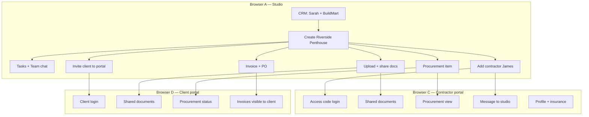

# One project — full pipeline (Studio + Contractor + Client)

End-to-end manual test for **one real project** across all three apps. Use **3–4 browser windows** (or profiles) so you can see the whole pipeline at once.

| Browser | App | URL | Who logs in |
|---------|-----|-----|-------------|
| **A** | Studio (main) | http://localhost:3000 | `admin.test@focuspilot.dev` |
| **B** | Studio (team) | http://localhost:3000 | `manager.test@focuspilot.dev` (optional) |
| **C** | Contractor portal | http://localhost:3002 | James Fletcher — access code |
| **D** | Client portal | http://localhost:3001 | Client invite credentials |

Deep dives: [test.md](test.md) (all modules) · [testing.md](testing.md) (Inbox + Notion) · [CONTRACTOR-PORTAL-TESTING-GUIDE.md](CONTRACTOR-PORTAL-TESTING-GUIDE.md) (share docs + insurance)

---

## 0. Start everything (once)

```powershell
# Terminal 1 — API
cd server
.\.venv\Scripts\Activate.ps1
python manage.py migrate
python manage.py runserver

# Terminal 2 — Studio
cd client
pnpm dev

# Terminal 3 — Client portal
cd client_portal
pnpm dev

# Terminal 4 — Contractor portal
cd contractors_portal
pnpm dev
```

| Service | URL |
|---------|-----|
| API | http://localhost:8000 |
| Studio | http://localhost:3000 |
| Client portal | http://localhost:3001 |
| Contractor portal | http://localhost:3002 |

**Env:** `server/.env` — `FRONTEND_URL=http://localhost:3000`, `RESEND_API_KEY` (contractor + client invite emails). Each frontend: `NEXT_PUBLIC_API_URL=http://localhost:8000`.

---

## 1. Master test data (copy-paste)

Use these values everywhere so CRM → Project → Finance → portals stay linked.

### Studio & users

| Role | Email | Password |
|------|-------|----------|
| Studio Admin (Browser A) | `admin.test@focuspilot.dev` | `TestPass1!` |
| Studio Manager (Browser B, optional) | `manager.test@focuspilot.dev` | `TestPass1!` |

| Entity | Value |
|--------|-------|
| Studio name | `Focus Test Studio` |

### CRM — client (project owner)

| Field | Value |
|-------|-------|
| Type | Client |
| Name | `Sarah` / Surname `Mitchell` |
| Company | `Mitchell Home Ltd` |
| Email | `sarah.mitchell@mitchellhome.co.uk` |
| Phone | `+44 20 7946 0123` |
| Address | `42 Belgravia Lane`, London `SW1A 1AA`, UK |
| Currency | GBP |

### CRM — supplier (procurement + PO)

| Field | Value |
|-------|-------|
| Type | Supplier |
| Company | `BuildMart Supplies Ltd` |
| Email | `orders@buildmart.co.uk` |

### The project (hero of this doc)

| Field | Value |
|-------|-------|
| **Project name** | `Riverside Penthouse` |
| **Project code** | `RIV-2026` |
| Type | Residential |
| Client | Sarah Mitchell / Mitchell Home Ltd |
| Description | `Full interior design — 3-bed penthouse, Thames view` |
| Start / End | `2026-06-01` → `2026-12-15` |
| Budget | `185000` GBP |
| Payment schedule | Per Phase |
| FF&E % | `15` |
| VAT | `20` |
| Delivery postcode | `SW11 4NJ` |

**Phases**

| # | Phase name | Duration |
|---|------------|----------|
| 1 | `Concept & Mood` | 4 weeks |
| 2 | `Detail Design` | 6 weeks |
| 3 | `Procurement & Install` | 12 weeks |

### Tasks (studio)

| Task title | Phase | Assignee | Due | Priority |
|------------|-------|----------|-----|----------|
| `Prepare mood boards` | Concept & Mood | manager.test@focuspilot.dev | 2026-06-20 | High |
| `Review FF&E selections` | Detail Design | admin (you) | Next Friday | Medium |
| Team chat message | — | — | `Kick-off call moved to Tuesday 3pm` | — |

### Procurement (one flagship item)

| Field | Value |
|-------|-------|
| Room | `Master Bedroom` |
| Item | `Custom oak wardrobe` |
| Supplier | BuildMart Supplies |
| Qty | 1 |
| Unit cost | `4200` |
| Status path | Ordered → Shipped → Delivered |

### Finance

| Doc | Key fields |
|-----|------------|
| Invoice | Client Sarah · Project Riverside · Line `Concept design fee — Phase 1` · `12500` GBP · Draft → Sent |
| PO | `PO-RIV-001` · BuildMart · `Oak flooring supply` · `6800` |

### Documents (studio uploads)

| Item | Notes |
|------|-------|
| Folder | `Concept Drawings` |
| File | `test-floorplan.pdf` (< 5 MB) |
| Share to contractor | Same PDF via Contractors → Share files |
| Share to client | Docs UI → share to client (client portal sees it) |

### Contractor (Browser C)

| Field | Value |
|-------|-------|
| First / Surname | `James` / `Fletcher` |
| Company | `Fletcher & Sons Builders` |
| Email | `james@fletcherbuilders.co.uk` |
| Phone | `+44 7700 900123` |
| Trade | `Joinery` |
| Access code | Note when created (e.g. `JFLT-01`) |
| Portal login | http://localhost:3002 → project QR/URL from **Project → Settings** |
| Profile (portal) | Emergency `Jane Fletcher` · Insurance expiry `2027-01-01` · upload PDF |
| Message to studio | `Delivery scheduled Thursday AM` |

### Client portal (Browser D)

| Field | Value |
|-------|-------|
| Invite from | Studio → **Project → Settings** → **Invite Client to Onboard** |
| Login email | From invite / `copy-client-credentials` (often `client.user@test.dev` or generated) |
| Password | From invite email or credentials dialog |

---

## 2. Pipeline diagram



---

## 3. Run order (start → end)

Tick each box when done. **Expected** is one line per step.

### Phase A — Studio sets up the job (Browser A)

| # | Step | Path | Expected |
|---|------|------|----------|
| A1 | Login | http://localhost:3000/login | Dashboard loads |
| A2 | CRM client | `/crm/contacts` → Add | Sarah Mitchell saved |
| A3 | CRM supplier | `/crm/contacts` → Add | BuildMart saved |
| A4 | New project | `/projects` → New | `Riverside Penthouse` card appears |
| A5 | Open project | `/projects/{id}` | Budget, client, phases correct |
| A6 | Tasks | `/projects/{id}/tasks` | Mood boards task in Concept phase |
| A7 | Team chat | `/projects/{id}/team` | Message sent; Browser B sees it (~5s) if used |
| A8 | Procurement | `/projects/{id}/procurement` | Oak wardrobe item; status updates |
| A9 | Files | `/projects/{id}/docs` | Folder + PDF uploaded |
| A10 | Invoice | `/finance/invoices/new` or project finance | Invoice for Sarah, project linked |
| A11 | PO | `/finance/purchase-order` | `PO-RIV-001` saved |
| A12 | Contractor | `/projects/{id}/contractors` → Add | James listed; access code + invite |
| A13 | Share file | Contractors → Share files | `bulk-share-documents` 200; PDF shared |
| A14 | Client invite | `/projects/{id}/settings` → Invite Client | Credentials / email; client user exists |
| A15 | Share doc to client | Project docs → client share | Client-visible flag on file |
| A16 | Time (optional) | Time tracking | 3.5 h on Riverside for reports |
| A17 | Reports smoke | `/reports/overview` | KPIs reflect invoice + hours |

**Optional (Notion):** Connect Notion → create task on project → row in Notion Tasks DB. See [notion_workflow.md](notion_workflow.md).

**Optional (Inbox):** Gmail connect → link thread to Riverside. See [testing.md](testing.md) Phase 1.

---

### Phase B — Contractor sees the site (Browser C)

| # | Step | Path | Expected |
|---|------|------|----------|
| B1 | Open portal | http://localhost:3002 | Login / project picker |
| B2 | Project access | `/project/{accessToken}` + code | Dashboard for Riverside |
| B3 | Documents | `/documents` | Shared `test-floorplan.pdf` only |
| B4 | Procurement | `/procurement` | Wardrobe item status matches studio |
| B5 | Messages | `/messages` | Send `Delivery scheduled Thursday AM` |
| B6 | Profile | `/profile` | Insurance + emergency contact saved |
| B7 | Studio check | Browser A → contractor messages / card | Insurance badge; message visible |

---

### Phase C — Client sees progress (Browser D)

| # | Step | Path | Expected |
|---|------|------|----------|
| C1 | Login | http://localhost:3001 | No studio admin menus |
| C2 | Dashboard | `/dashboard` | Riverside summary |
| C3 | Documents | `/documents` | Shared floorplan only |
| C4 | Procurement | `/procurement` | Client-visible subset of items |
| C5 | Finance | `/finance` | Sent invoice visible; no other clients’ data |

---

### Phase D — Close the loop (all browsers)

| # | Step | Who | Expected |
|---|------|-----|----------|
| D1 | Studio changes procurement status | A | Delivered |
| D2 | Contractor refreshes procurement | C | Status updated |
| D3 | Client refreshes procurement | D | Same status |
| D4 | Studio marks invoice Paid/Sent | A | Client finance updates |
| D5 | Remove shared doc (optional) | A → C | File gone from contractor portal |
| D6 | Two-browser task comment | A + B | Comment sync on same task |

---

## 4. Four-browser layout (recommended)

```
┌─────────────────────────┬─────────────────────────┐
│  A: Studio (Admin)      │  B: Studio (Manager)    │
│  localhost:3000         │  localhost:3000         │
│  Project + CRM + Finance│  Tasks + Team chat      │
├─────────────────────────┼─────────────────────────┤
│  C: Contractor          │  D: Client              │
│  localhost:3002         │  localhost:3001         │
│  Docs + Proc + Messages │  Docs + Proc + Finance  │
└─────────────────────────┴─────────────────────────┘
```

Keep **A** on `Riverside Penthouse` project tabs; **C** and **D** on the same project context after login.

---

## 5. API quick checks (F12 → Network)

| When | Method | URL | Pass |
|------|--------|-----|------|
| Add contractor | POST | `/contractor_portal/add/` | 200 + access_code |
| Share docs | POST | `/contractor_portal/bulk-share-documents/` | 200, `created` ≥ 1 |
| Contractor docs | GET | `/contractor_portal/documents/root_documents/?project_id=…` | Shared file listed |
| Client invite | POST | `/client_portal/generate-client-login/` | 200 |
| Client login | POST | client portal auth | Session / JWT |

---

## 6. One-page pass/fail

**PASS** if all are true:

- [ ] One project `Riverside Penthouse` exists with Sarah as client
- [ ] At least one task, one procurement line, one invoice, one shared studio doc
- [ ] James Fletcher on project with working access code on **C**
- [ ] Contractor sees shared PDF and procurement; message reaches studio
- [ ] Client invited; **D** sees dashboard, shared doc, invoice, procurement
- [ ] No cross-client data leak on client portal
- [ ] Studio reports/overview reflect the same project money and time

**FAIL** common causes: Resend not set (no invite email), wrong `project_id` on share, client not invited, contractor code typo, services not on 3000/3001/3002/8000.

---

## 7. ~45 min smoke (minimal)

If short on time, run only: **A2 → A4 → A6 → A8 → A10 → A12 → A13 → A14 → B2 → B3 → C1 → C3 → C5**.

---

*Project: Riverside Penthouse · Apps: Studio 3000, Client 3001, Contractor 3002, API 8000*
